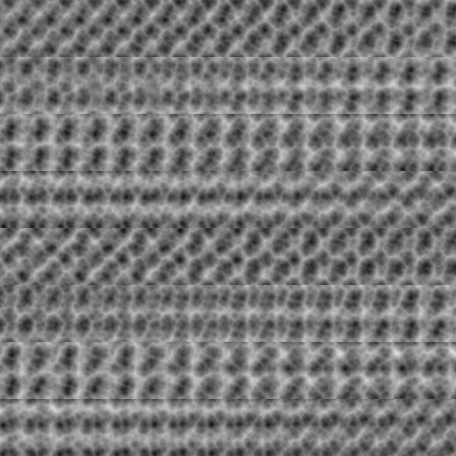

# Volumetric Texture Generator

A tool for generating volumetric 3D textures as greyscale PNG image grids. Each cell in the output image represents a Z-axis slice of a 3D noise volume, allowing you to visualize and use 3D textures in games, VFX, and procedural content generation.



*64³ volume generated with Worley Noise (seed 1337, 4 octaves) — 512×512 px, 8×8 grid of Z-slices.*

## Features

- **Zero dependencies** — Python standard library only (3.10+); optional `pyopencl` for GPU acceleration
- **Four noise algorithms** — Value Noise, Worley (Cellular), FBM Perlin Noise, and Voronoi (5 output modes)
- **GPU acceleration** — Optional OpenCL backend with 100% identical output (install `pyopencl` to enable)
- **Command-line interface** — Batch generation and scripting support
- **Interactive GUI** — Live preview, multiple noise types, parameter controls, and OpenCL toggle
- **Seamless tiling** — Generate wrap-around 3D textures with no edge seams
- **Power-of-two output** — Reference sizes chosen so the output PNG is always a power-of-two dimension
- **Configurable FBM** — Control octaves, frequency, lacunarity, and seed for fine-grained detail
- **Cancel support** — Threaded generation with progress bar and cancel in the GUI

## Noise Types

| Type | Description |
|------|-------------|
| **Value Noise** | Smooth interpolation of random values at grid points. Fast and simple. |
| **Worley Noise** | Cellular noise based on distance to nearest feature point. Produces organic, cell-like patterns. |
| **FBM Perlin Noise** | Fractal Brownian Motion with gradient-based Perlin noise. Rich, natural-looking detail across multiple octaves. |
| **Voronoi Noise** | Cellular noise with 5 output modes: `F1` (nearest distance), `F2` (second nearest), `F1 - F2` (edge highlight), `Jitter` (feature distance), `Edge` (normalized edge detection) |

## Installation

No installation required. The tool uses only the Python standard library.

**Requirements:**
- Python 3.10 or later
- A display server for the GUI (X11/Wayland on Linux, Windows, macOS)

**Optional — GPU Acceleration:**
- Install `pyopencl` for OpenCL GPU support: `pip install pyopencl`
- Requires an OpenCL-compatible GPU (NVIDIA, AMD, or Intel)
- When available, the GUI shows a "Use OpenCL (GPU)" checkbox

When OpenCL is not installed, all generation runs on CPU automatically.

## Running

### CLI

Generate a volumetric texture from the command line:

```bash
# Generate default 64³ texture
python generate_volumetric.py

# Custom parameters
python generate_volumetric.py --size 128 --seed 123 --octaves 6 --base-freq 0.5 --output my_texture.png
```

#### CLI Arguments

| Argument | Type | Default | Description |
|----------|------|---------|-------------|
| `--size`, `-s` | int | 64 | Cube dimension L |
| `--output`, `-o` | str | volumetric_texture.png | Output PNG path |
| `--octaves` | int | 4 | Number of noise octaves for detail |
| `--seed` | int | 42 | Random seed for reproducibility |
| `--base-freq` | float | 0.01 | Base noise frequency |
| `--lacunarity` | float | 2.0 | Frequency multiplier between octaves |
| `--noise-type` | str | `value` | Noise algorithm: `value`, `worley`, `perlin`, or `voronoi` |
| `--voronoi-mode` | str | `F1` | Voronoi output mode (only with `--noise-type voronoi`): `F1`, `F2`, `F1 - F2`, `Jitter`, `Edge` |

### GUI

Launch the interactive GUI:

```bash
python generate_volumetric_gui.py
```

#### GUI Controls

| Control | Description |
|---------|-------------|
| **Reference Size (L)** | Cube dimension. Options: 4, 16, 64, 256. Output dimensions are always a power of two (`L × √L`). |
| **Noise Type** | Select between Value Noise, Worley Noise, FBM Perlin Noise, and Voronoi Noise. |
| **Voronoi Mode** | When Voronoi Noise is selected, choose output mode: F1, F2, F1-F2, Jitter, or Edge. |
| **Base Freq** | Base frequency for the noise (0–100). |
| **Seed** | Random seed for reproducible results. Use the **Randomize** button for a new random seed. |
| **Octaves** | Number of FBM octaves (detail levels). |
| **Lacunarity** | Frequency multiplier between octaves (0–2). Default: 2.0. |
| **Use OpenCL (GPU)** | When `pyopencl` is installed and an OpenCL GPU is available, enable GPU-accelerated generation. Requires a restart of the generation to take effect. |
| **Output** | File path for the saved PNG. Use **Browse...** to pick a location. |

#### GUI Workflow

1. **Preview** — Generates a low-resolution preview (16³ volume, upscaled to 256px) for quick iteration without writing a file.
2. **Render** — Generates the full-resolution volume at the selected Reference Size and writes it to the output PNG file.

A live preview is displayed on the right side of the window and updates after each generation.

## Output Format

The output is a greyscale PNG where:

- Each cell is one Z-axis slice of the L×L×L volume
- Cells are arranged in a `√L × √L` grid
- Total dimensions: `(L × √L) × (L × √L)` pixels
- Pixel values range from 0 (black) to 255 (white)

| Reference Size (L) | Grid | Output Resolution |
|--------------------|------|-------------------|
| 4 | 2×2 | 8×8 px |
| 16 | 4×4 | 64×64 px |
| 64 | 8×8 | 512×512 px |
| 256 | 16×16 | 4096×4096 px |

## Project Structure

```
generate_volumetric.py        # CLI entry point + all noise algorithms and generation logic
generate_volumetric_gui.py    # GUI entry point (thin wrapper, imports from generate_volumetric.py)
generate_volumetric_gpu.py    # Optional OpenCL GPU backend (auto-falls back to CPU)
```

- `generate_volumetric.py` is self-contained with inline PNG writing and noise algorithms
- `generate_volumetric_gui.py` imports all generation logic and adds only the Tkinter UI layer
- `generate_volumetric_gpu.py` provides GPU-accelerated generation via OpenCL (optional dependency)
